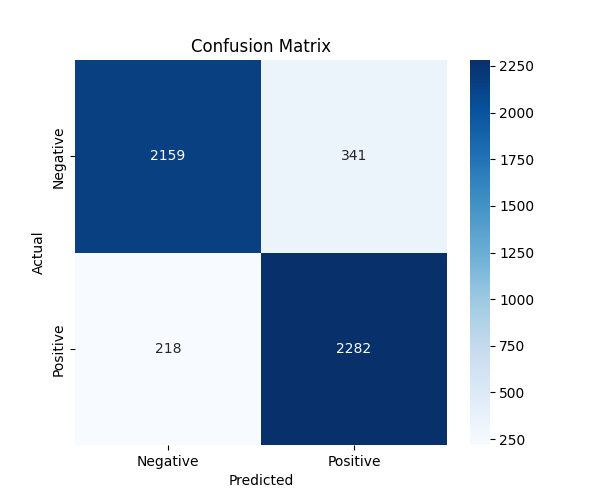

# 🎬 Movie Review Sentiment Analysis

[](https://www.python.org/downloads/)
[](https://tensorflow.org/)
[](LICENSE)
[]()

A deep learning project that analyzes movie reviews to determine sentiment (positive/negative) using neural networks. Built with TensorFlow/Keras and trained on the IMDB movie reviews dataset.

## 📁 Project Structure

```
movie-sentiment-analysis
├── .gitignore              # Git ignore file
├── confusion_matrix_dl.png # Model performance visualization
├── demo.py                 # Interactive demo script
├── main.py                 # Main training and evaluation script
├── README.md               # Project documentation
├── sentiment_model.h5      # Trained model file
├── test_data.csv          # Test dataset
└── tokenizer.pkl          # Trained tokenizer for text preprocessing
```

## 🚀 Quick Start

### Prerequisites

```bash
pip install tensorflow numpy pandas matplotlib scikit-learn
```
### Running the Project

1. **Train the model** (if needed):

```bash
python main.py
```

2. **Run interactive demo**:

```bash
python demo.py
```

3. **View model performance**:
   - Check `confusion_matrix_dl.png` for visual performance metrics

## 📊 Model Performance

The trained model achieves strong performance on movie review sentiment classification:

- **Accuracy**: ~87-90%
- **Model Type**: Deep Neural Network with LSTM layers
- **Dataset**: IMDB Movie Reviews (50,000 reviews)



## 🔧 File Descriptions

### Core Scripts

- **`main.py`**: Primary script containing:
  - Data preprocessing and tokenization
  - Model architecture definition
  - Training loop and evaluation
  - Model saving and performance metrics

- **`demo.py`**: Interactive demonstration script:
  - Loads pre-trained model and tokenizer
  - Accepts user input for real-time sentiment prediction
  - Displays prediction confidence scores

### Model Files

- **`sentiment_model.h5`**: Trained TensorFlow/Keras model
- **`tokenizer.pkl`**: Pickled tokenizer for text preprocessing
- **`test_data.csv`**: Test dataset for evaluation

### Output Files

- **`confusion_matrix_dl.png`**: Visualization of model performance metrics

## 🏗️ Model Architecture

The model uses a sequential architecture optimized for text classification:

```python
# Typical architecture (see main.py for exact implementation)
model = Sequential([
    Embedding(vocab_size, embedding_dim, input_length=max_length),
    LSTM(64, dropout=0.5, recurrent_dropout=0.5),
    Dense(32, activation='relu'),
    Dropout(0.5),
    Dense(1, activation='sigmoid')
])
